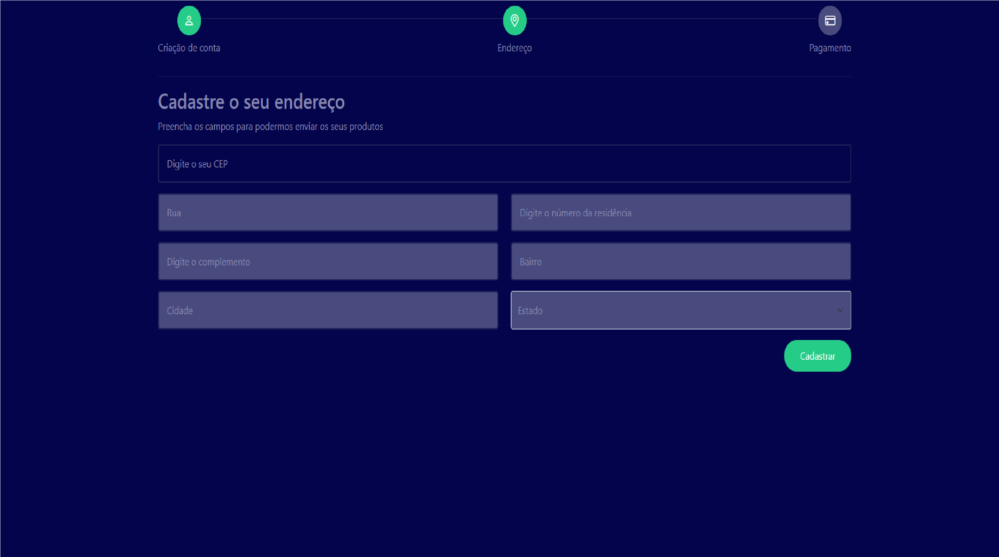

<h1>
    
    
Autocomplete_endereço

</h1>

#[Acesse Aqui](https://autocompleteendereco.vercel.app/)#

## 📕 Sobre

**Autocomplete_Endereço** é um aplicativo que facilita o preenchimento dos dados de endereço. Ele consome a API VIACEP para esse fim.

## 🔨 Tools
- [HTML5](https://developer.mozilla.org/pt-BR/docs/Web/HTML)
- [CSS3](https://developer.mozilla.org/pt-BR/docs/Web/CSS)
- [JAVASCRIPT](https://developer.mozilla.org/pt-BR/docs/Web/JavaScript)
- [BOOTSTRAP](https://getbootstrap.com/)

